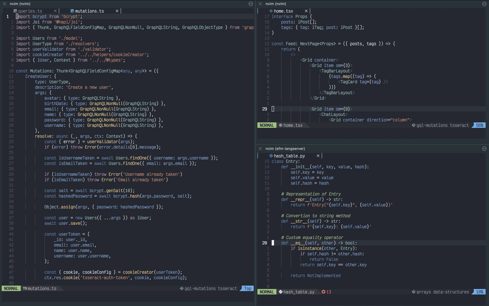

<h1 align="center">NeoVim Color Schemes 🎨</h1>

<div align="center">
  

  <p>Custom Color Schemes for NeoVim (🎨👆: Sofia)</p>
</div>

### Installed Themes

- [Sofia](./Sofia.yml)

### Requirements

These color schemes requires [treesitter](https://github.com/nvim-treesitter/nvim-treesitter) and [Neovim](https://neovim.io/) > 0.5.

### Installation

With `Packer`

```lua
use {'jeremy2918/nv-colorschemes'}
```

## Configuration

Add this to your `init.lua` file

```viml
require'nvim-treesitter.configs'.setup {
  ensure_installed = "all",
  highlight = {
    enable = true,
  },
}

vim.o.syntax = on
vim.cmd('colorscheme Sofia') -- Or your desired color scheme
vim.cmd('let g:nvcode_termcolors=256')
```

## Contribution

- Create a YAML file named as your color scheme (Ex: your_colorscheme_name.yml).

- Create your color scheme. You can use the [Sofia.yml](./Sofia.yml) as a template to start.

- Run the generate script and save the output to the colors directory.

  - `./build your_colorscheme_name.yml > ./colors/your_colorscheme_name.vim`

- Create and upload a PR.

### Credits

This repo is based in [ChristianChiarulli/nvcode-color-schemes.vim](https://github.com/ChristianChiarulli/nvcode-color-schemes.vim)
